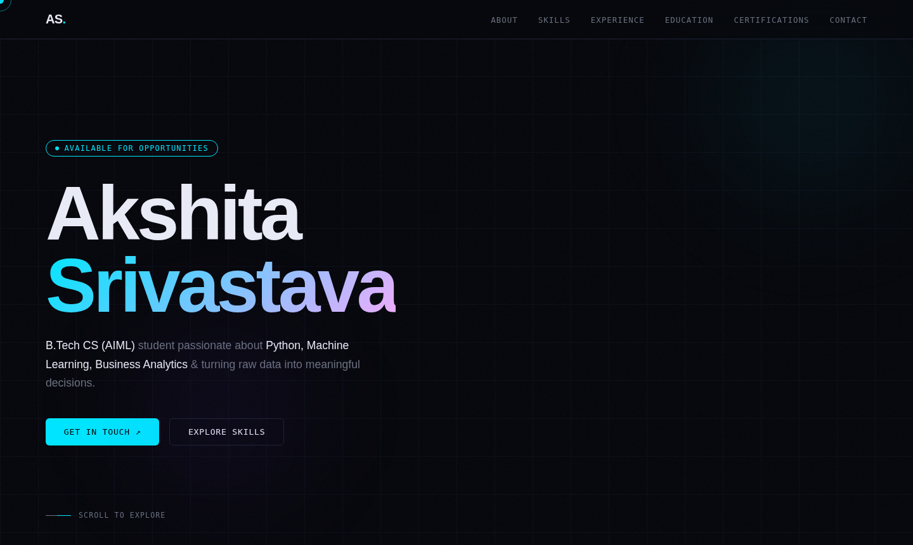
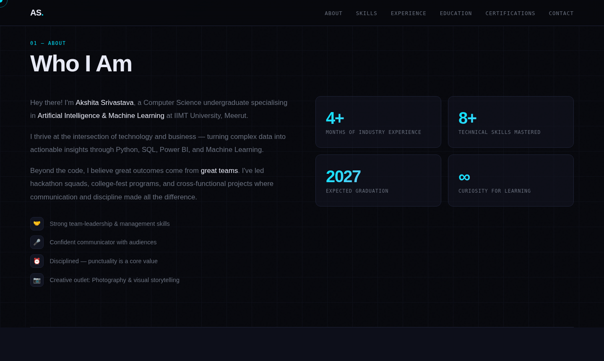
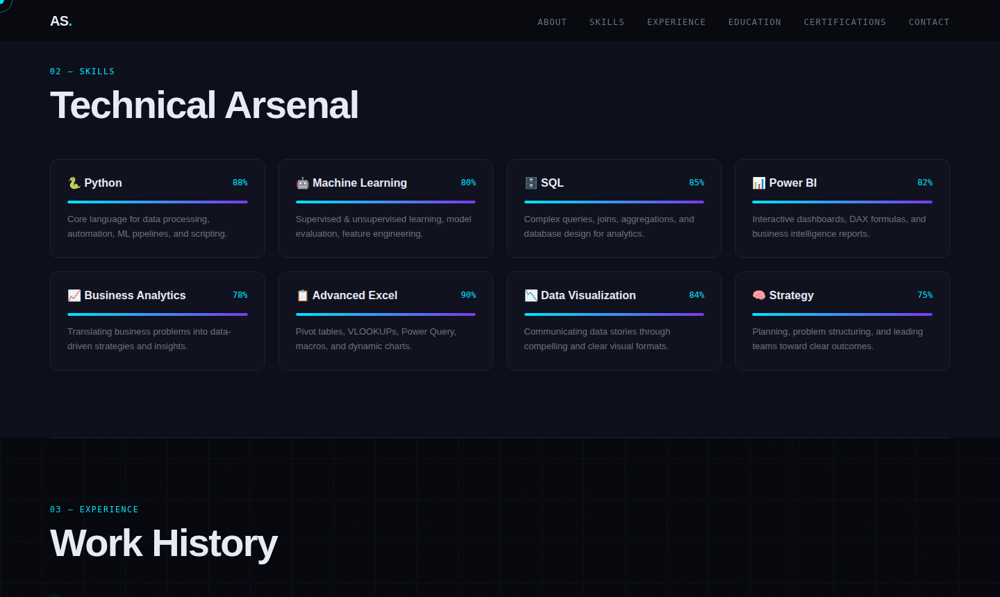
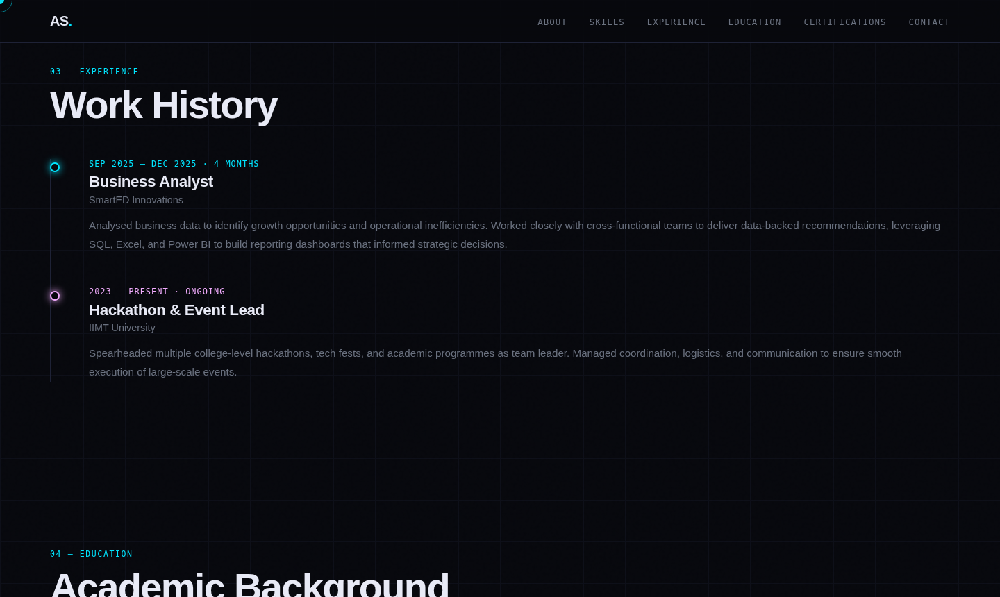

<div align="center">

# ✦ Akshita Srivastava — Personal Portfolio

### A futuristic, fully responsive personal portfolio website
### Built with pure HTML · CSS · JavaScript — zero dependencies

[](https://github.com)
[](https://developer.mozilla.org/en-US/docs/Web/HTML)
[](https://developer.mozilla.org/en-US/docs/Web/CSS)
[](https://developer.mozilla.org/en-US/docs/Web/JavaScript)
[](LICENSE)

</div>

---

## 🖥️ Live Preview

### Hero Section


### About Section


### Skills Section


### Experience Section


---

## 📁 Project Structure

```
portfolio/
│
├── PORTFOLIO.HTML          ← Main HTML structure & all content
├── PORTFOLIO.CSS           ← All styles, animations & responsive design
├── PORTFOLIO.JS            ← JavaScript interactions & effects
│
├── preview-hero.png        ← Screenshot — Hero section
├── preview-about.png       ← Screenshot — About section
├── preview-skills.png      ← Screenshot — Skills section
├── preview-experience.png  ← Screenshot — Experience section
│
└── README.md               ← Project documentation (this file)
```

---

## ⚡ Quick Start

### Step 1 — Download
Download or clone all files into one folder:
```
PORTFOLIO.HTML
PORTFOLIO.CSS
PORTFOLIO.JS
```

### Step 2 — Run
Double-click `PORTFOLIO.HTML` → Opens instantly in your browser. No installs. No terminal.

### Step 3 (Optional) — Use Live Server
For auto-reload while editing, use VS Code + **Live Server** extension:
1. Open the folder in VS Code
2. Right-click `PORTFOLIO.HTML` → **Open with Live Server**
3. Visit `http://127.0.0.1:5500`

---

## 🌟 Features

| # | Feature | Details |
|---|---------|---------|
| 🖱️ | **Custom Cursor** | Glowing dot + smooth lagging ring that scales on hover |
| 🎞️ | **Scroll Reveal** | Every section fades & slides in as it enters the viewport |
| 📊 | **Animated Skill Bars** | Progress bars animate smoothly when scrolled into view |
| 🔗 | **Active Nav Highlight** | Nav links auto-highlight based on current scroll position |
| 🌙 | **Dark Futuristic Theme** | Deep navy background with cyan & violet accent palette |
| ✨ | **Background Effects** | Animated CSS grid + noise texture + floating glowing blobs |
| ⚓ | **Smooth Scroll** | All anchor links use smooth scroll behaviour |
| 📱 | **Fully Responsive** | Works on mobile, tablet, and desktop |
| 🔝 | **Sticky Navbar** | Transparent nav with blur + depth shadow on scroll |
| 🎨 | **Hover Animations** | Cards, buttons & links all have polished hover transitions |

---

## 🎨 Design System

### Color Palette

| Variable | Hex | Usage |
|----------|-----|-------|
| `--bg` | `#07080d` | Main page background |
| `--bg2` | `#0d0f1a` | Alternate section background |
| `--surface` | `#111420` | Card surfaces |
| `--border` | `#1e2236` | Card & line borders |
| `--accent` | `#00e5ff` | Primary accent — Cyan |
| `--accent2` | `#7c3aed` | Secondary accent — Violet |
| `--accent3` | `#f0abfc` | Tertiary accent — Lavender |
| `--text` | `#e8eaf6` | Primary body text |
| `--muted` | `#6b7280` | Secondary / muted text |

### Typography

| Font | Weight | Usage |
|------|--------|-------|
| **Syne** | 800, 700, 600 | Display headings, large names, section titles |
| **DM Mono** | 400, 300 | Labels, tags, metadata, nav links, monospace UI |
| **DM Sans** | 500, 400, 300 | Body text, descriptions, paragraphs |

> All fonts are loaded via Google Fonts CDN — internet connection required on first load.

---

## 📄 Sections

| # | Section | Description |
|---|---------|-------------|
| 01 | **Hero** | Full-screen intro with animated name, status badge & CTA buttons |
| 02 | **About** | Personal bio, personality trait list & 4 animated stat cards |
| 03 | **Skills** | 8 skill cards with animated gradient progress bars |
| 04 | **Experience** | Timeline layout showcasing work & leadership history |
| 05 | **Education** | University card with degree, institution & subject tags |
| 06 | **Certifications** | Grid of achievement & certification cards |
| 07 | **Contact** | LinkedIn, Email & location links with hover effects |

---

## 🛠️ Customisation Guide

### 🔹 Update Your Name & Info
Open `PORTFOLIO.HTML` and find & replace:

```
"Akshita Srivastava"   →   Your Name
"akshita@email.com"    →   your@email.com
"akshita-11srivastava" →   your-linkedin-handle
"Meerut, UP, India"    →   Your City, Country
```

---

### 🔹 Change Skill Percentages
Find each `.skill-fill` in `PORTFOLIO.HTML`:

```html
<!-- data-width is a decimal (0.00 to 1.00) -->
<div class="skill-fill" data-width="0.88"></div>

<!-- Also update the label -->
<span class="skill-pct">88%</span>
```

---

### 🔹 Add a New Skill Card
Copy this block inside `.skills-grid` in `PORTFOLIO.HTML`:

```html
<div class="skill-card reveal reveal-delay-1">
  <div class="skill-header">
    <span class="skill-name">🔥 Your Skill</span>
    <span class="skill-pct">75%</span>
  </div>
  <div class="skill-bar">
    <div class="skill-fill" data-width="0.75"></div>
  </div>
  <p class="skill-desc">Brief description of this skill.</p>
</div>
```

---

### 🔹 Add a New Experience Entry
Copy this block inside `.timeline` in `PORTFOLIO.HTML`:

```html
<div class="exp-item reveal reveal-delay-1">
  <div class="exp-dot"></div>
  <div class="exp-meta">Month Year — Month Year · Duration</div>
  <div class="exp-role">Your Job Title</div>
  <div class="exp-company">Company Name</div>
  <p class="exp-desc">
    What you did and achieved in this role.
  </p>
</div>
```

---

### 🔹 Change Accent Color
In `PORTFOLIO.CSS`, update the `:root` block:

```css
:root {
  --accent:  #00e5ff;  /* Change to your color e.g. #ff6b6b */
  --accent2: #7c3aed;  /* Change secondary */
  --accent3: #f0abfc;  /* Change tertiary */
}
```

---

### 🔹 Add a New Section
1. Add your section in `PORTFOLIO.HTML`:
```html
<section id="projects">
  <div class="section-label">07 — Projects</div>
  <h2 class="section-title reveal">My Projects</h2>
  <!-- your content here -->
</section>
```
2. Add a nav link:
```html
<li><a href="#projects">Projects</a></li>
```
3. Style it in `PORTFOLIO.CSS` using existing patterns.

---

## 🌍 Deployment Guide

### ▶ GitHub Pages (Free — Recommended)
```bash
# 1. Create a GitHub repo
# 2. Push your files
git init
git add .
git commit -m "Initial portfolio commit"
git remote add origin https://github.com/yourusername/portfolio.git
git push -u origin main

# 3. Go to GitHub → Settings → Pages
# 4. Set source: main branch / root
# 5. Live at: https://yourusername.github.io/portfolio
```

### ▶ Netlify (Drag & Drop — Easiest)
1. Go to [netlify.com](https://netlify.com)
2. Drag your entire project folder onto the deploy zone
3. Get a live URL instantly — e.g. `https://akshita-portfolio.netlify.app`

### ▶ Vercel (CLI — Fastest)
```bash
npm i -g vercel
cd your-portfolio-folder
vercel
# Follow prompts — live in 30 seconds
```

---

## 📦 Dependencies

**Zero runtime dependencies.** The portfolio uses:

| Resource | Type | Purpose |
|----------|------|---------|
| Google Fonts | CDN | Syne, DM Mono, DM Sans typography |
| Vanilla JS | Built-in | All interactivity & animations |
| Pure CSS | Built-in | All styling & layout |

> No jQuery · No Bootstrap · No Tailwind · No npm install needed

---

## 🔧 Browser Support

| Browser | Supported |
|---------|-----------|
| Chrome 90+ | ✅ Full |
| Firefox 88+ | ✅ Full |
| Safari 14+ | ✅ Full |
| Edge 90+ | ✅ Full |
| IE 11 | ❌ Not supported |

---

## 📃 License

```
MIT License — Free to use, modify & distribute for personal portfolios.
Attribution appreciated but not required.
```

---

<div align="center">

**Built with ♥ by Akshita Srivastava**

`Python` · `Machine Learning` · `Power BI` · `SQL` · `Business Analytics`

*B.Tech CS (AIML) · IIMT University, Meerut · Class of 2027*

</div>
